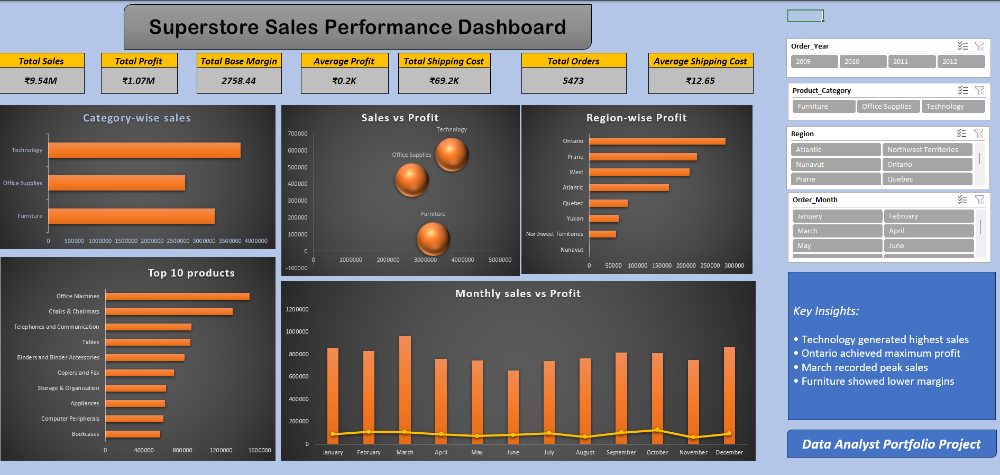
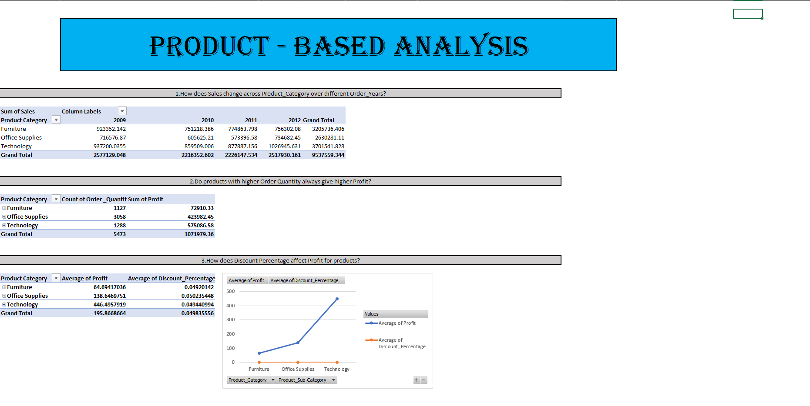
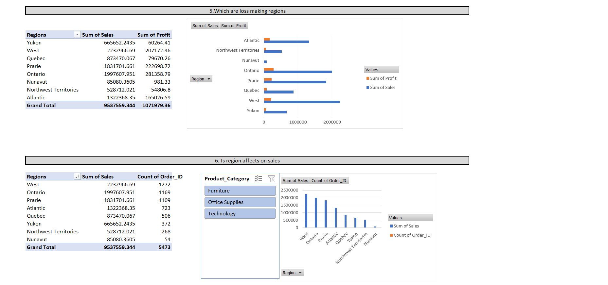
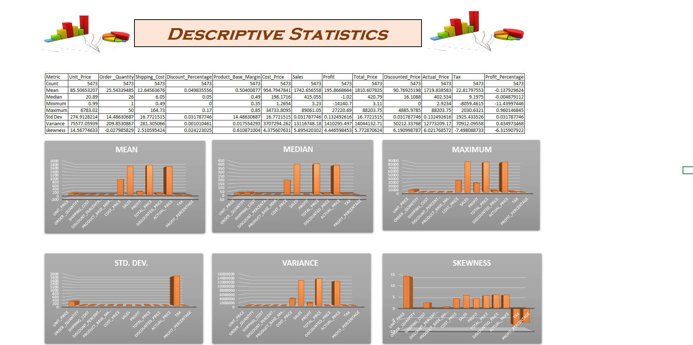
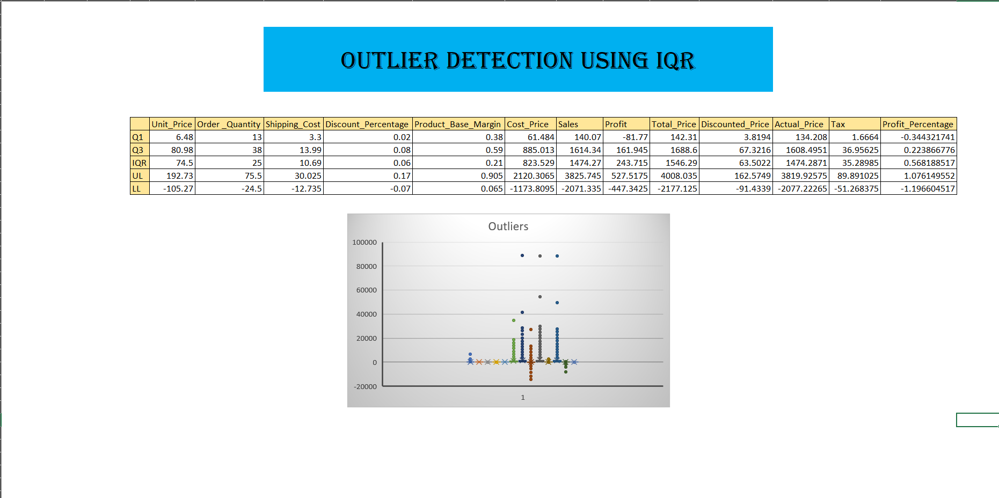

# 📊 Superstore Sales Analysis Dashboard

An end-to-end Excel Data Analytics project focused on analyzing Superstore sales performance, identifying business trends, and generating actionable insights through interactive dashboards and data-driven analysis.

---

# 🚀 Project Overview

This project was built using Microsoft Excel to perform comprehensive sales and profit analysis on Superstore transactional data.  
The project demonstrates data cleaning, statistical analysis, business intelligence reporting, and dashboard development skills.

The dashboard provides meaningful business insights related to:
- Sales Performance
- Profitability
- Product Trends
- Regional Analysis
- Customer Segmentation

---

# 📦 Dataset Information

The dataset contains retail superstore transaction records used to analyze sales performance, profitability, customer segments, product trends, and regional business insights.

### Dataset Size
- 📄 Total Rows: 5,474
- 📊 Total Columns: 34
- 🗂️ File Format: Excel / CSV

### Key Columns
- Order_ID
- Order_Date
- Ship_Date
- Delivery_Time
- Order_Priority
- Ship_Mode
- Customer_Name
- Province
- Region
- Customer_Segment
- Product_Category
- Product_Sub-Category
- Unit_Price
- Order_Quantity
- Shipping_Cost
- Discount_Percentage
- Sales
- Profit
- Profit_Percentage

---

# 🛠️ Tools & Technologies Used

- Microsoft Excel
- Pivot Tables
- Pivot Charts
- Conditional Formatting
- Statistical Analysis
- Data Cleaning Techniques
- Interactive Dashboard Design

---

# 📈 Key Analysis Performed

## 🔹 Data Cleaning
- Removed inconsistencies
- Structured raw data for analysis
- Prepared dataset for dashboard reporting

## 🔹 Outlier Detection
- Identified abnormal sales and profit values
- Improved analytical accuracy

## 🔹 Descriptive Statistics
- Mean
- Median
- Standard Deviation
- Min & Max Values
- Distribution Analysis

## 🔹 Product-Based Analysis
- Top Performing Products
- Category-wise Sales Trends
- Profit Contribution Analysis

## 🔹 Regional Analysis
- Region-wise Sales Comparison
- Profit Trends Across Provinces
- Regional Business Performance

## 🔹 Business Analysis
- KPI Tracking
- Profitability Insights
- Business Trend Identification

---

# 📊 Dashboard Highlights

The interactive dashboard provides:

✅ Sales Performance Overview  
✅ Profit Analysis  
✅ Regional Insights  
✅ Product Category Analysis  
✅ KPI Monitoring  
✅ Trend Visualization  
✅ Interactive Filtering & Analysis  

---

# 📂 Project Structure

```text
superstore_sales_analysis/
│
├── README.md
├── Superstore_Sales_Analysis_Dashboard.xlsx
├── superstore_dataset.csv
└── screenshots/
    ├── dashboard.png
    ├── descriptive_stats.png
    ├── outlier_detection.png
    ├── product_analysis.png
    └── regional_analysis.png
```

---

# 🖼️ Dashboard Preview

## 📌 Main Dashboard


---

# 📷 Analysis Screenshots

## Product Analysis


## Regional Analysis


## Descriptive Statistics


## Outlier Detection


---

# 🎯 Project Objectives

- Analyze business sales performance
- Identify profitable products and regions
- Generate business insights from transactional data
- Build interactive Excel dashboards
- Practice real-world data analytics workflow

---

# 📌 Conclusion

This project demonstrates practical Excel skills for:
- Data Cleaning
- Business Intelligence
- Statistical Analysis
- Dashboard Development
- Insight Generation

The project reflects a complete end-to-end Excel analytics workflow commonly used in real-world business environments.

---

# 👨‍💻 Author

Avinash Chavan
